# Healthcare Management System

## Project Overview

This Laravel project provides a Healthcare Management System with three existing models: Patient, Doctor, and the default Laravel User model. Students must extend this foundation with individual features to showcase their Laravel skills in CRUD operations, relationships, validation, routing, and middleware.

## 1. Appointment Scheduling

### User Story 1: As a patient, I want to schedule appointments with healthcare providers so that I can receive medical care.
- I can view available time slots for different doctors
- I can select a preferred date and time for my appointment
- I can specify the reason for my visit
- I receive a confirmation of my appointment

### User Story 2: As a healthcare provider, I want to manage my appointment schedule so that I can organize my patient visits.
- I can view all my appointments in a calendar format
- I can approve, reschedule, or cancel appointments
- I can set my availability and working hours
- I can add notes to appointment entries

## 2. Patient Records

### User Story 1: As a healthcare provider, I want to access and update patient records so that I can provide informed care.
- I can view patient medical history and demographics
- I can add notes from current consultations
- I can update patient health status and conditions
- I can view previous visit information

### User Story 2: As a patient, I want to access my medical records so that I can review my health information.
- I can view my past visits and diagnoses
- I can see my current medications and prescriptions
- I can access my lab results and imaging reports
- I can download medical certificates and reports

## 3. Prescription Management

### User Story 1: As a doctor, I want to create and manage prescriptions so that patients can receive appropriate medication.
- I can prescribe medications with dosage instructions
- I can view a patient's medication history and allergies
- I can specify refill information
- I can send prescriptions directly to pharmacies

### User Story 2: As a patient, I want to view and manage my prescriptions so that I can take medications correctly.
- I can see all my active and past prescriptions
- I can request prescription refills
- I can report side effects or issues
- I can set medication reminders

## 4. Billing and Insurance

### User Story 1: As a billing administrator, I want to manage patient billing so that services are properly charged.
- I can generate invoices for patient visits and services
- I can process payments and insurance claims
- I can manage payment plans for patients
- I can generate financial reports

### User Story 2: As a patient, I want to manage my healthcare billing so that I can pay for services and use my insurance.
- I can view and pay my medical bills online
- I can submit my insurance information
- I can see which services are covered by my insurance
- I can download receipts and billing statements

## 5. Lab Results Management

### User Story 1: As a laboratory technician, I want to upload and manage lab results so that doctors can access patient test information.
- I can upload test results to patient records
- I can categorize and organize different types of tests
- I can flag abnormal results for doctor review
- I can track the status of pending tests

### User Story 2: As a doctor, I want to review patient lab results so that I can make informed treatment decisions.
- I can view all lab results for my patients
- I can compare current results with previous ones
- I can add interpretations and notes to results
- I can order follow-up tests based on results

## 6. Staff Scheduling

### User Story 1: As a hospital administrator, I want to manage staff schedules so that the facility is properly staffed.
- I can create work schedules for different departments
- I can assign staff to shifts based on skills and availability
- I can manage time-off requests
- I can ensure adequate coverage for all shifts

### User Story 2: As a healthcare staff member, I want to view and request changes to my schedule so that I can maintain work-life balance.
- I can view my upcoming shifts and assignments
- I can request time off or shift swaps
- I can set my availability preferences
- I can receive notifications about schedule changes

## 7. Telemedicine Services

### User Story 1: As a doctor, I want to conduct virtual consultations so that I can treat patients remotely.
- I can start video consultations with patients
- I can access patient records during the call
- I can document the consultation and diagnosis
- I can prescribe medications or order tests remotely

### User Story 2: As a patient, I want to attend virtual appointments so that I can receive care without visiting the facility.
- I can join video appointments from my device
- I can test my connection before the appointment
- I can share symptoms or concerns during the consultation
- I can receive follow-up instructions electronically

## 8. Inventory Management

### User Story 1: As an inventory manager, I want to track medical supplies so that the facility maintains adequate stock.
- I can add and categorize inventory items
- I can update stock quantities and locations
- I can set reorder thresholds for essential supplies
- I can generate inventory reports

### User Story 2: As a healthcare provider, I want to request supplies so that I have the necessary materials for patient care.
- I can view available supplies in inventory
- I can submit requests for needed supplies
- I can track the status of my requests
- I can report when supplies are low or depleted

## 9. Doctor Referrals

### User Story 1: As a doctor, I want to refer patients to specialists so that they can receive specialized care.
- I can search for specialists by specialty and availability
- I can create and send referral documents
- I can include relevant patient information and reason for referral
- I can track the status of referrals I've made

### User Story 2: As a patient, I want to manage my referrals so that I can follow through on my doctor's recommendations.
- I can view details of specialist referrals
- I can schedule appointments with referred specialists
- I can access and share my referral documents
- I can provide feedback after specialist visits

## 10. Treatment Plans

### User Story 1: As a doctor, I want to create treatment plans so that patients can follow structured care regimens.
- I can define treatment goals and milestones
- I can specify medications, therapies, and activities
- I can set timelines and follow-up appointments
- I can update plans based on patient progress

### User Story 2: As a patient, I want to access my treatment plan so that I can follow my doctor's recommendations.
- I can view my complete treatment plan
- I can track my progress against plan milestones
- I can record symptoms and side effects
- I can communicate with my provider about the plan

## 11. Emergency Notifications

### User Story 1: As a hospital administrator, I want to send emergency alerts so that staff can respond to urgent situations.
- I can create different types of emergency notifications
- I can target notifications to specific departments or staff
- I can include response instructions in alerts
- I can track acknowledgment of emergency messages

### User Story 2: As a healthcare staff member, I want to receive emergency notifications so that I can respond appropriately.
- I can receive alerts through multiple channels
- I can acknowledge receipt of emergency messages
- I can access emergency protocols and instructions
- I can communicate my status during emergencies

## 12. Patient Education

### User Story 1: As a healthcare provider, I want to share educational materials with patients so that they can better understand their health conditions.
- I can select from a library of educational resources
- I can assign specific materials to patients based on their conditions
- I can create custom educational content
- I can track whether patients have viewed materials

### User Story 2: As a patient, I want to access health education resources so that I can learn about my condition and treatment.
- I can view educational materials assigned by my provider
- I can search for information about specific health topics
- I can save important resources for future reference
- I can indicate when I've completed educational modules

## 13. Vaccination Records

### User Story 1: As a healthcare provider, I want to manage patient vaccination records so that I can ensure patients are properly immunized.
- I can record administered vaccines with dates and lot numbers
- I can view a patient's complete vaccination history
- I can schedule upcoming vaccine doses
- I can generate vaccination certificates

### User Story 2: As a patient, I want to access my vaccination history so that I can keep track of my immunizations.
- I can view my complete vaccination record
- I can see recommended vaccines based on my age and health status
- I can receive reminders for due or overdue vaccines
- I can share my vaccination records with other providers

## 14. Medical Equipment Management

### User Story 1: As a facility manager, I want to track medical equipment so that I can ensure proper maintenance and availability.
- I can maintain an inventory of all medical equipment
- I can schedule regular maintenance and calibration
- I can track equipment location and assignment
- I can manage equipment repair and replacement

### User Story 2: As a healthcare provider, I want to reserve and use medical equipment so that I can provide patient care.
- I can search for available equipment
- I can reserve equipment for specific time periods
- I can report equipment issues or malfunctions
- I can view usage instructions for equipment

## 15. Patient Portal

### User Story 1: As a patient, I want to manage my healthcare information through a portal so that I can take an active role in my care.
- I can update my personal and insurance information
- I can message my healthcare providers
- I can view upcoming appointments and test results
- I can request prescription refills

### User Story 2: As a healthcare administrator, I want to manage the patient portal so that patients can access appropriate information.
- I can configure which information is visible to patients
- I can reset patient portal credentials
- I can monitor portal usage and activity
- I can help patients troubleshoot portal issues

## 16. Visit Check-In/Check-Out

### User Story 1: As a front desk staff member, I want to manage patient check-ins so that I can track patient arrivals and wait times.
- I can check in patients when they arrive
- I can verify patient information and insurance
- I can estimate and communicate wait times
- I can notify providers when patients are ready

### User Story 2: As a patient, I want to check in for my appointments so that the facility knows I've arrived.
- I can check in using a kiosk or mobile app
- I can update my information during check-in if needed
- I can see my estimated wait time
- I can receive notifications when it's my turn

## 17. Health Metrics Tracking

### User Story 1: As a patient, I want to track my health metrics so that I can monitor my condition between visits.
- I can record measurements like blood pressure and glucose levels
- I can view trends in my health data over time
- I can set goals for specific health metrics
- I can share my tracking data with my providers

### User Story 2: As a doctor, I want to review patient-tracked health metrics so that I can provide more informed care.
- I can view patient-recorded health data
- I can see trends and patterns in patient metrics
- I can set threshold alerts for concerning values
- I can provide feedback on patient tracking

## 18. Medical Document Management

### User Story 1: As a healthcare provider, I want to manage medical documents so that I can maintain comprehensive patient records.
- I can upload and categorize medical documents
- I can search for documents by type, date, or content
- I can control access permissions for sensitive documents
- I can annotate and comment on documents

### User Story 2: As a patient, I want to access and upload medical documents so that my records are complete.
- I can view documents shared by my healthcare providers
- I can upload external medical records
- I can organize documents by category
- I can securely share documents with other providers

## 19. Allergy and Medication Alerts

### User Story 1: As a doctor, I want to receive alerts about patient allergies and medication interactions so that I can prevent adverse events.
- I am notified of patient allergies when accessing their record
- I receive warnings about potential drug interactions
- I can document allergy severity and reactions
- I can override alerts with appropriate justification

### User Story 2: As a patient, I want to manage my allergy information so that my healthcare providers are aware of potential risks.
- I can add and update my allergy information
- I can specify the severity and symptoms of allergic reactions
- I can see warnings about medications I should avoid
- I receive alerts if prescribed medications conflict with my allergies

## 20. Healthcare Analytics

### User Story 1: As a hospital administrator, I want to access healthcare analytics so that I can make data-driven decisions.
- I can view dashboards with key performance indicators
- I can analyze patient demographics and visit patterns
- I can track provider productivity and efficiency
- I can generate custom reports for different metrics

### User Story 2: As a quality improvement officer, I want to monitor care metrics so that I can identify areas for improvement.
- I can track patient outcomes for different conditions
- I can compare performance against benchmarks
- I can identify trends in patient satisfaction
- I can generate quality improvement reports

## ERD

```mermaid
erDiagram
    User ||--o{ Patient : "can be"
    User ||--o{ Doctor : "can be"
    User ||--o{ Staff : "can be"
    
    Patient ||--o{ Appointment : "schedules"
    Doctor ||--o{ Appointment : "manages"
    Appointment ||--|| AppointmentStatus : "has"
    
    Patient ||--o{ MedicalRecord : "has"
    Doctor ||--o{ MedicalRecord : "creates"
    MedicalRecord ||--o{ Document : "contains"
    
    Doctor ||--o{ Prescription : "creates"
    Patient ||--o{ Prescription : "receives"
    Prescription ||--o{ Medication : "includes"
    
    Patient ||--o{ Bill : "receives"
    Appointment ||--o{ Bill : "generates"
    Bill ||--o{ PaymentTransaction : "has"
    Patient ||--o{ Insurance : "submits"
    Insurance ||--o{ Bill : "covers"
    
    Patient ||--o{ LabResult : "has"
    Doctor ||--o{ LabResult : "orders"
    LabTechnician ||--o{ LabResult : "processes"
    Staff ||--|| LabTechnician : "is a"
    
    Staff ||--o{ Schedule : "has"
    Department ||--o{ Staff : "employs"
    
    Doctor ||--o{ VirtualConsultation : "conducts"
    Patient ||--o{ VirtualConsultation : "attends"
    VirtualConsultation ||--|| Appointment : "is a"
    
    InventoryManager ||--o{ InventoryItem : "manages"
    Staff ||--|| InventoryManager : "is a"
    Staff ||--o{ SupplyRequest : "submits"
    InventoryItem ||--o{ SupplyRequest : "fulfills"
    
    Doctor ||--o{ Referral : "creates"
    Patient ||--o{ Referral : "receives"
    Specialist ||--o{ Referral : "receives"
    Doctor ||--|| Specialist : "can be"
    
    Doctor ||--o{ TreatmentPlan : "creates"
    Patient ||--o{ TreatmentPlan : "follows"
    
    Administrator ||--o{ EmergencyNotification : "sends"
    Staff ||--|| Administrator : "is a"
    Staff ||--o{ EmergencyNotification : "receives"
    
    Doctor ||--o{ EducationalMaterial : "assigns"
    Patient ||--o{ EducationalMaterial : "views"
    
    Patient ||--o{ Vaccination : "receives"
    Doctor ||--o{ Vaccination : "administers"
    
    EquipmentManager ||--o{ MedicalEquipment : "manages"
    Staff ||--|| EquipmentManager : "is a"
    Staff ||--o{ EquipmentReservation : "makes"
    MedicalEquipment ||--o{ EquipmentReservation : "has"
    
    Patient ||--|| PatientPortal : "uses"
    Administrator ||--o{ PatientPortal : "manages"
    
    FrontDeskStaff ||--o{ CheckIn : "processes"
    Staff ||--|| FrontDeskStaff : "is a"
    Patient ||--o{ CheckIn : "performs"
    Appointment ||--|| CheckIn : "requires"
    
    Patient ||--o{ HealthMetric : "tracks"
    Doctor ||--o{ HealthMetric : "reviews"
    
    Patient ||--o{ Allergy : "reports"
    Doctor ||--o{ MedicationAlert : "receives"
    Prescription ||--o{ MedicationAlert : "triggers"
    Allergy ||--o{ MedicationAlert : "triggers"
    
    Administrator ||--o{ AnalyticsReport : "generates"
    QualityImprovementOfficer ||--o{ AnalyticsReport : "reviews"
    Staff ||--|| QualityImprovementOfficer : "is a"
    
    User {
        int id PK
        string name
        string email
        string password
        string user_type
        timestamp created_at
        timestamp updated_at
    }
    
    Patient {
        int id PK
        int user_id FK
        date date_of_birth
        string gender
        string address
        string phone
        string emergency_contact
        string blood_type
        timestamp created_at
        timestamp updated_at
    }
    
    Doctor {
        int id PK
        int user_id FK
        string specialization
        string license_number
        string department
        string phone
        text bio
        timestamp created_at
        timestamp updated_at
    }
    
    Staff {
        int id PK
        int user_id FK
        string position
        string department
        string employee_id
        timestamp created_at
        timestamp updated_at
    }
    
    Appointment {
        int id PK
        int patient_id FK
        int doctor_id FK
        datetime scheduled_time
        string reason
        int status_id FK
        text notes
        timestamp created_at
        timestamp updated_at
    }
    
    AppointmentStatus {
        int id PK
        string name
        string description
        timestamp created_at
        timestamp updated_at
    }
    
    MedicalRecord {
        int id PK
        int patient_id FK
        int doctor_id FK
        date visit_date
        text diagnosis
        text treatment
        text notes
        timestamp created_at
        timestamp updated_at
    }
    
    Document {
        int id PK
        int medical_record_id FK
        string type
        string title
        string file_path
        timestamp created_at
        timestamp updated_at
    }
    
    Prescription {
        int id PK
        int doctor_id FK
        int patient_id FK
        date issue_date
        date expiry_date
        text notes
        timestamp created_at
        timestamp updated_at
    }
    
    Medication {
        int id PK
        int prescription_id FK
        string name
        string dosage
        string frequency
        string duration
        int refills
        timestamp created_at
        timestamp updated_at
    }
    
    Bill {
        int id PK
        int patient_id FK
        int appointment_id FK
        decimal amount
        string status
        date due_date
        int insurance_id FK
        timestamp created_at
        timestamp updated_at
    }
    
    PaymentTransaction {
        int id PK
        int bill_id FK
        decimal amount
        date payment_date
        string payment_method
        string transaction_id
        timestamp created_at
        timestamp updated_at
    }
    
    Insurance {
        int id PK
        int patient_id FK
        string provider
        string policy_number
        date start_date
        date end_date
        timestamp created_at
        timestamp updated_at
    }
    
    LabResult {
        int id PK
        int patient_id FK
        int doctor_id FK
        int lab_technician_id FK
        string test_name
        date test_date
        text result
        boolean abnormal
        text interpretation
        timestamp created_at
        timestamp updated_at
    }
    
    Schedule {
        int id PK
        int staff_id FK
        datetime start_time
        datetime end_time
        string shift_type
        timestamp created_at
        timestamp updated_at
    }
    
    Department {
        int id PK
        string name
        string location
        timestamp created_at
        timestamp updated_at
    }
    
    VirtualConsultation {
        int id PK
        int appointment_id FK
        string meeting_link
        datetime start_time
        datetime end_time
        text notes
        timestamp created_at
        timestamp updated_at
    }
    
    InventoryItem {
        int id PK
        string name
        string category
        int quantity
        string location
        int threshold
        timestamp created_at
        timestamp updated_at
    }
    
    SupplyRequest {
        int id PK
        int staff_id FK
        int item_id FK
        int quantity
        string status
        text reason
        timestamp created_at
        timestamp updated_at
    }
    
    Referral {
        int id PK
        int doctor_id FK
        int patient_id FK
        int specialist_id FK
        date referral_date
        text reason
        string status
        timestamp created_at
        timestamp updated_at
    }
    
    TreatmentPlan {
        int id PK
        int doctor_id FK
        int patient_id FK
        date start_date
        date end_date
        text goals
        text activities
        text medications
        timestamp created_at
        timestamp updated_at
    }
    
    EmergencyNotification {
        int id PK
        int sender_id FK
        string type
        text message
        string target_department
        datetime sent_at
        timestamp created_at
        timestamp updated_at
    }
    
    EducationalMaterial {
        int id PK
        string title
        string content_type
        string file_path
        text description
        timestamp created_at
        timestamp updated_at
    }
    
    Vaccination {
        int id PK
        int patient_id FK
        int doctor_id FK
        string vaccine_name
        date administration_date
        string lot_number
        date next_dose_date
        timestamp created_at
        timestamp updated_at
    }
    
    MedicalEquipment {
        int id PK
        string name
        string type
        string serial_number
        date purchase_date
        date last_maintenance
        date next_maintenance
        string status
        string location
        timestamp created_at
        timestamp updated_at
    }
    
    EquipmentReservation {
        int id PK
        int staff_id FK
        int equipment_id FK
        datetime start_time
        datetime end_time
        string purpose
        timestamp created_at
        timestamp updated_at
    }
    
    PatientPortal {
        int id PK
        int patient_id FK
        boolean active
        datetime last_login
        timestamp created_at
        timestamp updated_at
    }
    
    CheckIn {
        int id PK
        int patient_id FK
        int appointment_id FK
        datetime check_in_time
        datetime check_out_time
        timestamp created_at
        timestamp updated_at
    }
    
    HealthMetric {
        int id PK
        int patient_id FK
        string metric_type
        decimal value
        string unit
        datetime recorded_at
        text notes
        timestamp created_at
        timestamp updated_at
    }
    
    Allergy {
        int id PK
        int patient_id FK
        string allergen
        string reaction
        string severity
        timestamp created_at
        timestamp updated_at
    }
    
    MedicationAlert {
        int id PK
        int doctor_id FK
        int prescription_id FK
        int allergy_id FK
        string alert_type
        text message
        boolean acknowledged
        timestamp created_at
        timestamp updated_at
    }
    
    AnalyticsReport {
        int id PK
        int creator_id FK
        string report_type
        json data
        date report_date
        timestamp created_at
        timestamp updated_at
    }
```

